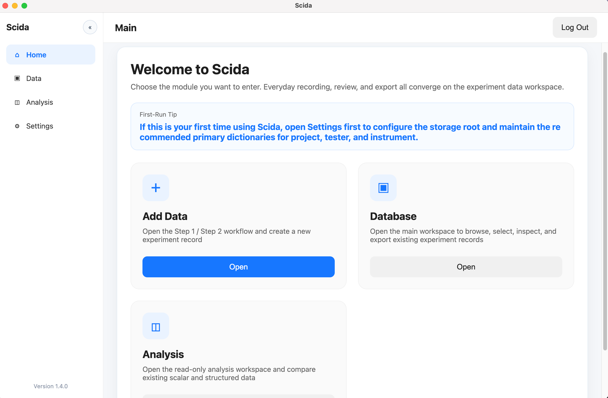
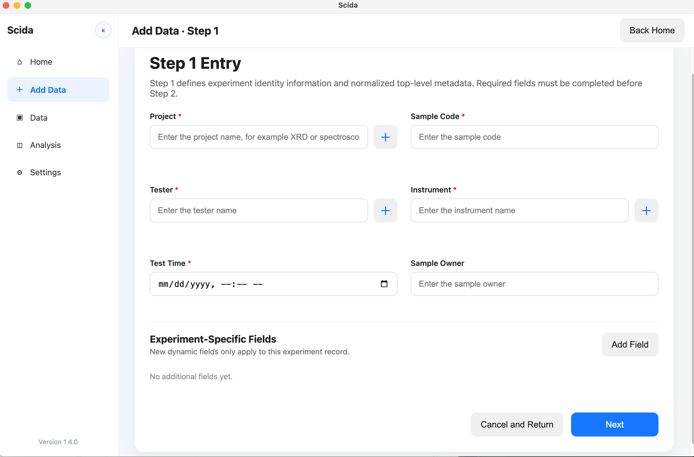
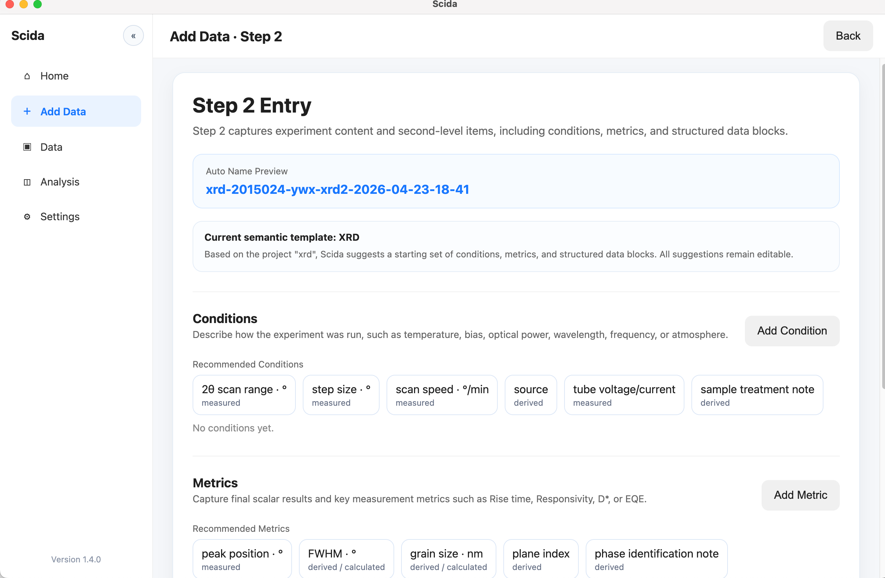
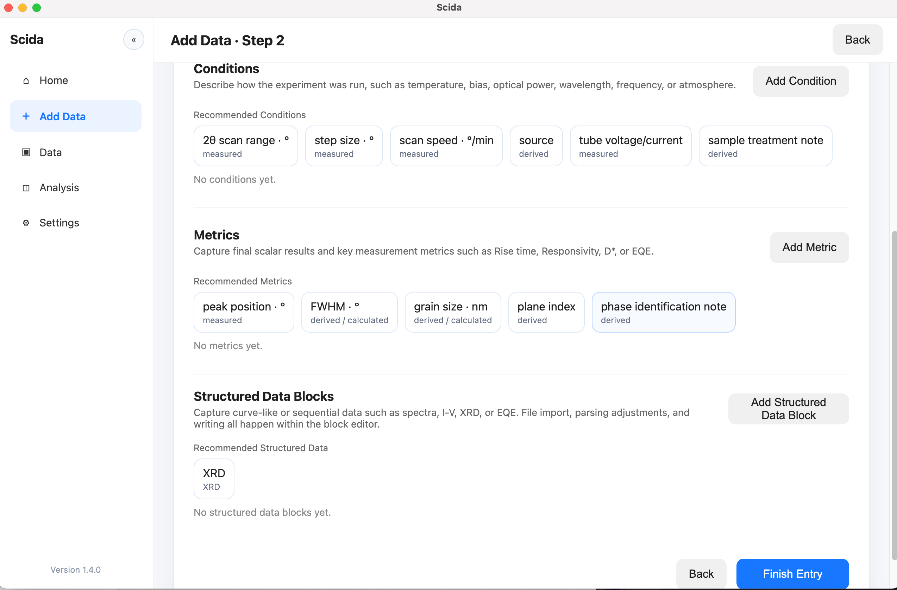
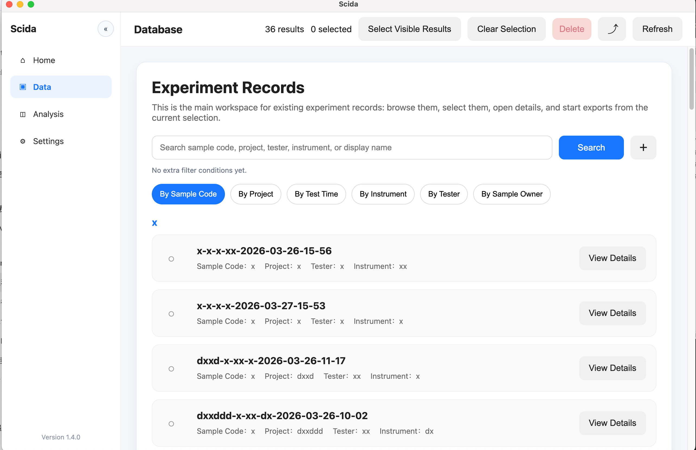
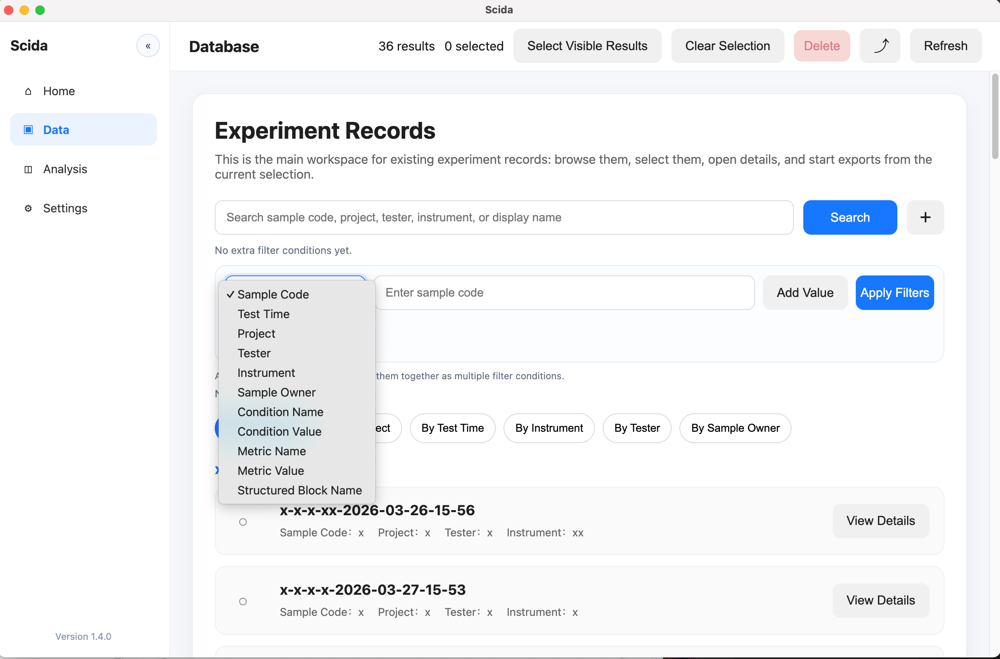
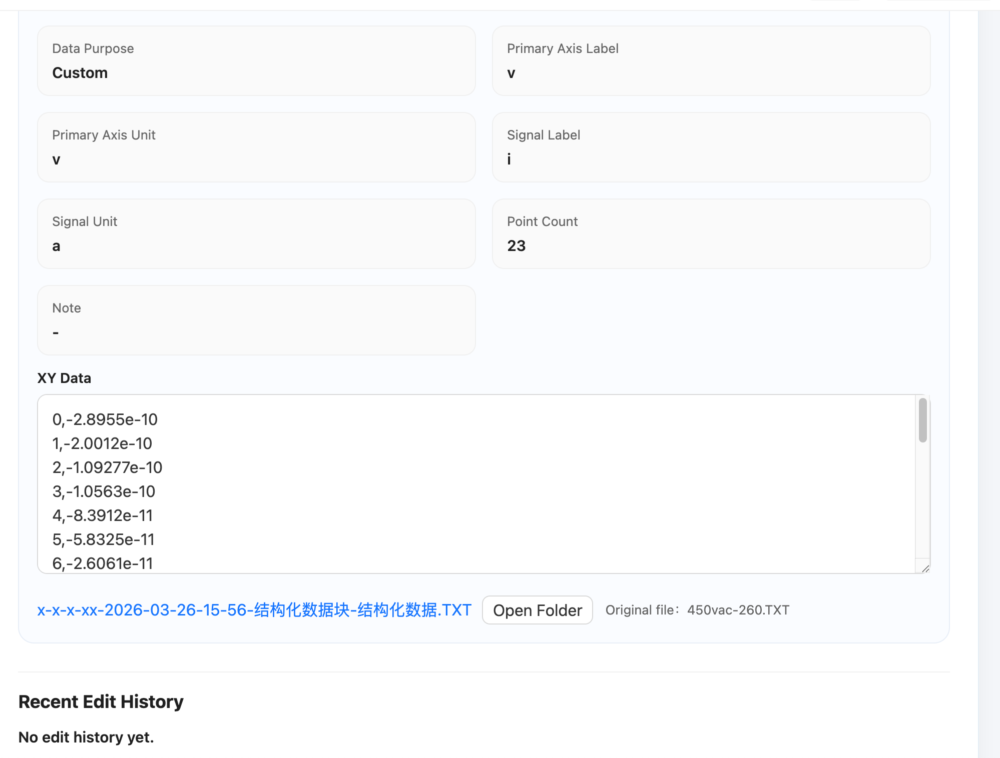
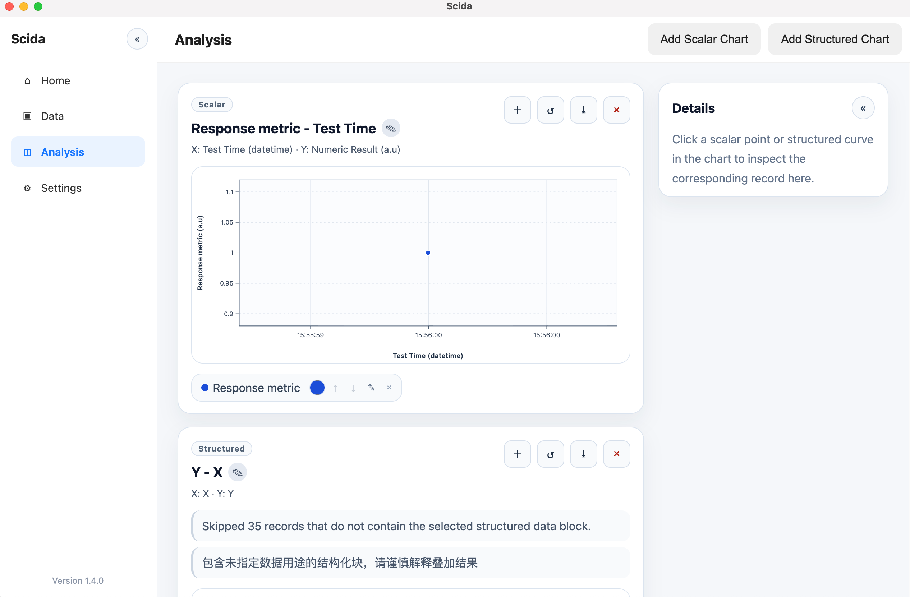
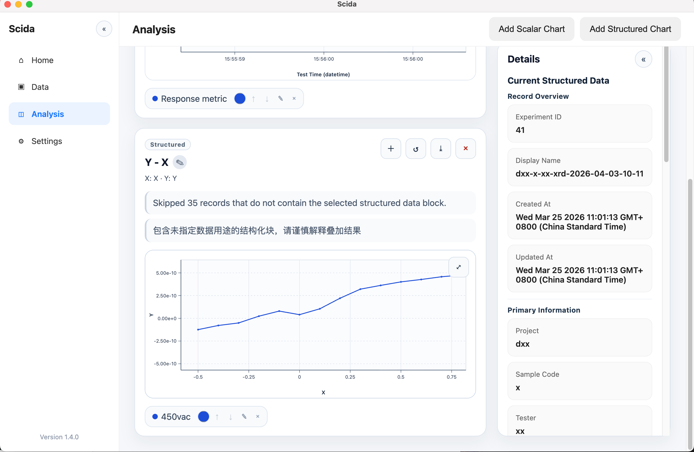
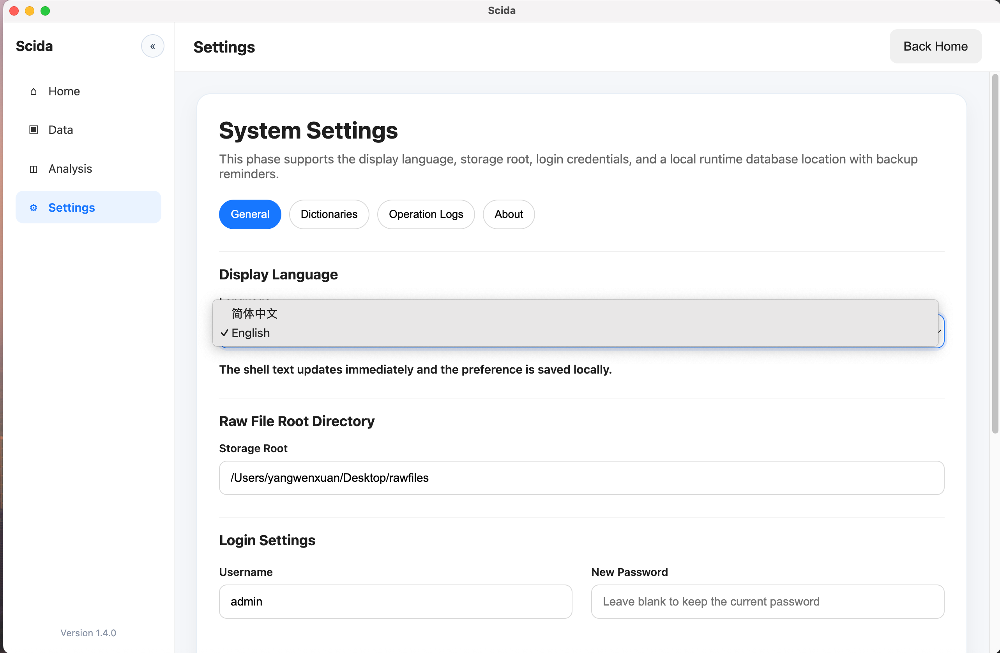

# Scida

**Scida is a local-first scientific data workspace for individual experimental research workflows.**  
**Scida 是一个面向个人实验科研工作流的、本地优先 scientific data workspace。**

---

## Overview / 项目概述

Scida is a desktop tool for keeping experiment records, raw files, structured data, lightweight analysis, and export in one local workflow. It is designed for individual researchers who want their data to stay understandable and reusable after the experiment itself is over.

Scida 是一个桌面工具，用来把实验记录、原始文件、结构化数据、轻量分析和导出整合进同一个本地工作流。它面向的是个人研究者，希望在实验结束之后，数据仍然保持可理解、可检索、可复用。

It was originally shaped around my own graduate research workflow and the way I expect to work in future PhD research: recording experiments carefully, keeping files tied to record context, and being able to search, compare, and export results later without moving everything into a cloud platform first.

它最初是围绕我自己的研究生科研工作流，以及我未来博士阶段预期会持续使用的工作方式逐步形成的：认真记录实验、让文件和记录上下文保持关联，并且在后续能够检索、比较和导出结果，而不是先把所有东西迁移到云平台里。

---

## Why Scida / 为什么做 Scida

In many real experimental workflows, data does not disappear. It becomes scattered across folders, spreadsheets, screenshots, file names, temporary notes, and half-remembered decisions. The longer that situation continues, the harder it becomes to review past experiments or reuse results cleanly.

在很多真实实验工作流里，数据并不是“没有了”，而是逐渐散落到文件夹、表格、截图、文件名、临时笔记和一些当时记得、后来忘了的判断里。这个状态持续得越久，后面回看旧实验、整理结果、复用数据就越困难。

Scida exists to reduce that friction with a practical local-first workflow: keep records structured, keep files attached to their experimental context, keep analysis lightweight and read-only, and keep export focused on usable local outputs.

Scida 想解决的正是这种摩擦：用一个务实的本地优先工作流，把实验记录结构化、把文件和实验上下文绑在一起、把分析保持在轻量且只读的层面、把导出保持为真正可用的本地输出。

---

## What Scida Focuses On / Scida 重点解决的问题

- Structured experiment records that are easier to search and review later.  
  让实验记录更结构化，后续更容易检索和回看。
- Local raw-file management with a configurable storage root.  
  通过可配置存储根目录管理本地原始文件。
- Guided data entry for practical research workflows instead of free-form data sprawl.  
  用引导式录入减少科研工作流中的自由散乱输入。
- Read-only comparison views for existing results, without turning analysis into a second data source.  
  提供已有结果的只读比较视图，而不是再造一套数据源。
- Export that stays file-oriented and useful for reports, papers, and local reuse.  
  保持面向文件的导出方式，便于汇报、论文和本地复用。

---

## Who It Is For / 适合谁

Scida is built for individual researchers, especially people who repeatedly run experiments, accumulate many local files, and need to come back later to understand what was done, what was measured, and what should be exported.

Scida 主要面向个人研究者，尤其适合那些会重复开展实验、持续积累大量本地文件，并且需要在之后重新理解“做了什么、测了什么、该导出什么”的使用者。

It is particularly relevant for graduate students, PhD students, and research-heavy personal workflows where keeping raw files, structured measurements, and record context together matters.

它尤其适合研究生、博士生，以及那些对个人科研工作流依赖很重、需要把原始文件、结构化测量数据和实验记录上下文保持在一起的人。

---

## What It Is Not / 它不是什么

Scida is not a full LIMS, not a team ELN platform, not a cloud-first research service, and not a heavy enterprise lab management system.

Scida 不是完整的 LIMS，不是团队协作型 ELN 平台，不是云优先科研服务，也不是重型企业级实验室管理系统。

It is a serious personal research tool: local-first, focused, and designed around day-to-day experimental work rather than institutional workflow complexity.

它更像一个认真打磨的个人科研工具：本地优先、目标聚焦，核心是解决日常实验工作的真实问题，而不是覆盖机构级流程复杂度。

---

## Core Features / 核心能力

### Experiment Records / 实验记录

- Structured experiment records with guided Step 1 and Step 2 entry.  
  支持 Step 1 和 Step 2 引导式录入的结构化实验记录。
- Top-level metadata organization for project, sample, instrument, tester, and timing context.  
  组织项目、样品、仪器、测试人和时间等顶层元数据。

### Raw Files / 原始文件

- Managed raw-file storage tied to the experiment workflow.  
  将原始文件管理与实验工作流保持关联。
- Configurable local storage root.  
  支持可配置的本地存储根目录。

### Structured Data / 结构化数据

- Separate conditions, metrics, and structured data blocks for clearer record structure.  
  将实验条件、结果指标和结构化数据块拆分管理，使记录结构更清晰。
- Semantic-template guidance for common workflows.  
  为常见工作流提供语义模板引导。

### Lightweight Analysis / 轻量分析

- Read-only analysis workspace for comparing existing records.  
  只读分析工作区，用于比较已有记录。
- Scalar and structured views focused on practical comparison rather than pipeline orchestration.  
  提供标量和结构化视图，重点在实用比较，而不是复杂分析流水线。

### Export / 导出

- Local file export for full record packages and selected data items.  
  支持完整记录包与选定数据项的本地文件导出。
- Output remains oriented toward local reuse in reports, archives, and papers.  
  输出面向本地复用，适合汇报、归档和论文整理。

### Bilingual UI / 双语界面

- `zh-CN`
- `English`

The main public-facing workflows now support both Chinese and English UI guidance.  
当前主要公开工作流已经支持中英文界面引导。

---

## Screenshots / 截图

### Home / 首页

The main workspace entry for navigating records, analysis, and settings.  
主工作区入口，用于进入记录、分析和设置。



### Step 1 / Step 1

Structured entry for top-level experiment identity and metadata.  
用于录入顶层实验身份信息和元数据的结构化界面。



### Step 2 / Step 2

Guided entry for conditions, metrics, and structured data blocks.  
用于录入实验条件、结果指标和结构化数据块的引导式界面。




### Database / 数据库

Search, filter, group, and inspect historical experiment records.  
对历史实验记录进行搜索、筛选、分组和查看。





### Analysis / 分析

Read-only comparison views for scalar and structured data across records.  
对不同记录之间的标量数据和结构化数据进行只读比较。




### Settings / 设置

Settings for language, storage behavior, backup reminder information, and release shell surfaces.  
用于语言、存储行为、备份提醒和发布外壳信息的设置界面。



---

## Current Status / 当前状态

Scida is already usable as a local-first desktop research tool, but it is still evolving. The current releases are focused on practical personal workflow value rather than broad enterprise-style completeness.

Scida 现在已经可以作为一个本地优先的桌面科研工具使用，但它仍然在持续演进。当前版本更强调个人科研工作流中的实际价值，而不是追求企业软件式的全面覆盖。

The product direction is clear: structured records, local files, lightweight analysis, and export. The product surface is broader than an early prototype, but it is still intentionally focused.

它的产品方向已经比较清楚：结构化记录、本地文件、轻量分析和导出。当前界面和工作流已经比早期原型更完整，但整体仍然是有意识地保持聚焦。

---

## Downloads / 下载

Download packaged builds from the repository’s **Releases** page.  
可以从仓库的 **Releases** 页面下载打包版本。

If you are browsing this project on GitHub, that is the correct place to get the latest published artifacts.  
如果你是在 GitHub 上查看这个项目，获取最新发布产物的正确入口就是 Releases 页面。

---

## Platform Notes / 平台说明

### macOS

Current macOS release automation is being prepared for proper public distribution, but public binaries should still be treated conservatively unless Developer ID signing and notarization are actually enabled for the release you download.

macOS 发布自动化正在朝正式公开分发质量完善，但在某个具体 release 确认启用 Developer ID 签名和 notarization 之前，公开二进制仍应保守看待。

### Windows

Windows artifacts are available through release builds, but code signing is still a separate release-quality concern.

Windows 产物可以通过 release 构建获得，但代码签名仍然是一个需要单独完善的发布质量问题。

### General note / 通用说明

Current binaries should still be treated as unsigned build artifacts unless signing/notarization is explicitly added to public releases later.

当前二进制文件在后续公开版本明确补上签名/notarization 之前，仍应视为未签名构建产物。

---

## Domain Focus / 领域侧重点

Scida was shaped most directly by photodetector and optoelectronic experiment workflows. That is where the current templates, semantic defaults, and record guidance feel most natural.

Scida 目前最直接的领域侧重点仍然是光电探测器和光电子实验工作流。当前模板、语义默认值和记录引导在这个方向上会最自然。

That does not mean the product is only for that domain. It means the first practical version was shaped by a real research background rather than by an abstract generic design brief.

但这并不意味着它只能用于这个方向。更准确地说，Scida 的第一版实用形态来自真实研究背景，而不是来自一个抽象的通用产品设定。

---

## Development Note / 开发说明

Scida was developed with strong help from AI tools, especially Codex. That help mattered a lot. At the same time, the product direction, workflow judgment, and day-to-day prioritization come from real research needs rather than from “build a demo app” goals.

Scida 的开发得到了 AI 工具，尤其是 Codex 的强协助。这种协助非常重要。但与此同时，产品方向、工作流判断和日常优先级仍然来自真实科研需求，而不是“做一个演示 app”。

I am building this as a serious personal research tool first. If it becomes broadly useful to others, that will be because the underlying workflow problems are real and shared.

我首先把它当成一个认真打磨的个人科研工具来做。如果它后面能对更多人有用，那应该是因为它解决的是很多人共同面对的真实工作流问题。

---

## Tech Stack / 技术栈

- Electron
- TypeScript
- Prisma
- SQLite
- ExcelJS
- Vite
- Electron Forge

Scida is a local-first Electron desktop app built with a practical TypeScript + SQLite stack.  
Scida 是一个本地优先的 Electron 桌面应用，采用务实的 TypeScript + SQLite 技术栈。

---

## Project Structure / 项目结构

### Main Process / 主进程

- `src/main.ts`
  - app lifecycle
  - runtime database preparation
  - IPC registration
  - filesystem access
  - export logic

  - 应用生命周期
  - 运行时数据库准备
  - IPC 注册
  - 文件系统访问
  - 导出逻辑

### Preload Bridge / 预加载桥

- `src/preload.ts`
  - exposes typed `window.electronAPI`
  - keeps direct Node/Electron access out of the renderer

  - 暴露带类型的 `window.electronAPI`
  - 避免渲染层直接接触 Node/Electron 能力

### Renderer / 渲染层

- `src/renderer.ts`
- `src/renderer/render-helpers.ts`
- `src/renderer/i18n.ts`

These files render the interface, manage UI state, and host the bilingual shell and workflow guidance.  
这些文件负责渲染界面、管理 UI 状态，并承载双语界面与流程引导。

### Database and Migrations / 数据库与迁移

- `prisma/schema.prisma`
- `prisma/migrations/`
- `dev.db`

### Additional documentation / 其他文档

- `docs/DATABASE.md`
- `docs/DEFAULT_TEMPLATES.md`
- `docs/EXPORT_FLOW.md`
- `docs/MODULE_GUIDE.md`

---

## Runtime Database Behavior / 运行时数据库行为

The runtime database lives at `app.getPath('userData')/scidata.db`. On first launch, the app can copy `dev.db` into the runtime location when needed, then check and apply pending migrations before Prisma connects.

运行时数据库位于 `app.getPath('userData')/scidata.db`。首次启动时，如有需要，应用会先把 `dev.db` 复制到运行时位置，然后在 Prisma 建连前检查并执行待处理迁移。

Existing runtime databases are backed up before startup migrations or auth-setting upgrades are applied.

在启动迁移或认证设置升级执行之前，现有运行时数据库会先被备份。

---

## Authentication / 身份验证

Fresh installs go through onboarding before login. Login verification happens in the main process, and the renderer does not receive stored password material.

全新安装会先完成 onboarding，再进入登录。登录校验发生在主进程，渲染层不会接触保存的密码材料。

Settings store `loginUsername` and a hashed `loginPasswordHash`, rather than exposing plaintext passwords to the renderer.

应用设置中保存的是 `loginUsername` 和哈希后的 `loginPasswordHash`，而不是把明文密码暴露给渲染层。

---

## Release and CI / 发布与持续集成

Scida uses GitHub Actions to build release artifacts for macOS and Windows. The current automation is focused on practical artifact production first, with release-quality signing/notarization work being added carefully and separately.

Scida 使用 GitHub Actions 为 macOS 和 Windows 构建发布产物。当前自动化优先保证发布产物可生成，而更高标准的签名/notarization 则在谨慎地单独补齐。

This repository already includes release-oriented packaging work, but you should not assume every public binary is fully signed and notarized unless the release explicitly says so.

当前仓库已经包含面向发布的打包流程，但除非某个 release 明确说明已完成签名和 notarization，否则不应默认认为所有公开二进制都具备完整分发信任链。

---

## Useful Commands / 常用命令

```bash
npm install
npm run start
npm run lint
npx tsc --noEmit
npm run package
npm run make
npm run docs:structure
```

These are the main local development and release-prep commands used in the repository today.  
这些是当前仓库里最常用的本地开发和发布准备命令。

---

## Additional Docs / 其他文档

- [Database Notes](docs/DATABASE.md) / 数据库说明
- [Default Templates](docs/DEFAULT_TEMPLATES.md) / 默认模板说明
- [Export Flow](docs/EXPORT_FLOW.md) / 导出流程说明
- [Module Guide](docs/MODULE_GUIDE.md) / 模块说明

If you want a deeper technical view after reading the product overview, these documents are the right next step.  
如果你在看完产品概述之后希望进一步了解技术细节，这些文档是合适的下一步入口。

---

## Roadmap / 路线图

- keep improving public-release quality  
  持续提升公开发布质量
- make the bilingual experience more complete and more polished  
  继续补齐并打磨双语使用体验
- improve workflow clarity for real research use rather than expanding blindly  
  优先提升真实科研使用中的流程清晰度，而不是盲目扩功能
- gradually broaden template and workflow coverage beyond the initial domain focus  
  在初始领域重点之外，逐步扩展模板和工作流覆盖范围

The roadmap is intentionally practical: make the existing workflow more solid before trying to become a very broad platform.  
路线图会继续保持务实：先把已有工作流做扎实，再考虑更广泛的平台化扩展。

---

## Feedback / 反馈

If Scida overlaps with your own research workflow, feedback is very welcome, especially around record structure, template guidance, bilingual clarity, export needs, and places where the product still feels too narrow or too rough.

如果 Scida 和你的科研工作流有重叠，非常欢迎反馈，尤其是关于记录结构、模板引导、双语清晰度、导出需求，以及哪些地方仍然显得过窄或不够成熟。

GitHub Issues is the most practical place to leave product feedback, workflow problems, and release-related observations.

GitHub Issues 是提交产品反馈、工作流问题和发布相关观察最实际的入口。

---

## License / 许可证

MIT License.

MIT 许可证。
